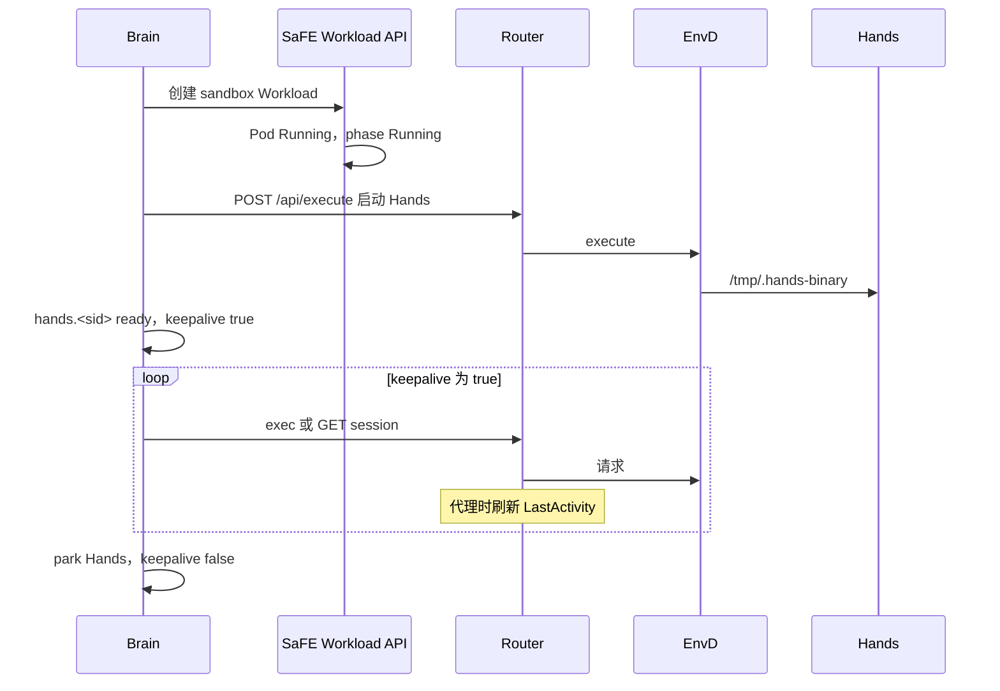

# Sandbox 会话生命周期与用户进程判定

本文说明 Claw 会话如何使用 sandbox、当前 Pod 如何管理，以及 Claw 如何判定 sandbox 内已无用户任务进程。判定不依赖 Hyperloom、Ray、进程名白名单，也不依赖 sandbox idle-GC 的文件戳。

## 拓扑

一个 Claw sandbox Workload 对应一个 Pod：

- Init 容器 `envd-injector` 将 `envd` 及相关二进制拷到共享卷后退出。
- 运行时只有容器 `codeinterpreter`。其命令 `exec` `/shared/bin/envd`。容器存活期间 EnvD 为 PID 1。
- 注解 `primus-safe.main.container=codeinterpreter`。`RestartPolicy` 为 `Never`。

Agent（prompt）跑在 **brain** 里，不在容器内。Brain 经 sandbox Router 访问 Pod，Router 将 `POST /api/execute` 代理到 EnvD。Hands 同样经 execute 拉起（`/tmp/.hands-binary`）后常驻。用户命令是这条 execute 路径上的子进程（Hands `spawn`，或 shell 里的 `setsid` / `nohup`）。

EnvD 是常驻 HTTP 服务（`/health`、`/api/execute`、tmux session、文件、GPU）。用户命令结束不会让 EnvD 退出。`codeinterpreter` 容器停止表示 EnvD 自身退出（崩溃、OOM、节点丢失），不表示用户任务已完成。

多节点 GPU 工作是 **另一份** SaFE Workload（InferaDeployment 或 RayJob），仅当 prompt 含 `--nodes >= 2` 且明确指定 `--mn-backend` 时创建。容器内 `ray.init()` 不是平台 RayJob，也不作为存活信号。

## 当前管理流程



### 创建

1. Brain 解析任务（workspace、镜像、timeout、可选多节点标志）。
2. Brain 创建 SaFE sandbox Workload。SaFE 创建 Sandbox CR 和 Pod。
3. Brain 等待 Workload phase 变为 `Running`。
4. Brain 经 Router → EnvD execute 启动 Hands，并在 KV 中写入 `hands.<sid>`。

### 会话使用 sandbox 期间

- 工具调用和 shell 走 Router → EnvD `/api/execute`（Hands 起来之后也可在容器内 `spawn`）。
- EnvD `execute` 使用 `Setpgid`，避免 HTTP 结束时 `CommandContext` 取消杀掉整个 `setsid` 进程组。
- 一次 HTTP execute 进行中，Router 在请求未结束时刷新 Redis `LastActivity`。

### Keepalive 与 idle-GC（当前）

Brain keepalive（默认间隔 60s）对 `keepalive: true` 的 sandbox 发 ping：

- agent-sandbox：`GET` session，从而更新 `LastActivity`。
- safe-workload：`exec` 一条短命令（历史上会写 `/tmp/keepalive_ts`）。该文件不是控制面输入；刷新 `LastActivity` 的是这次代理请求。

Sandbox idle-GC 在 Redis `LastActivity` 超过 15 分钟时删除 Sandbox（可用注解覆盖）。SaFE `timeout` 仍会停止仍在运行的 Workload。

任务 park 后 `keepalive` 置为 false。Keepalive 随后探测 Hands `/internal/shells/active`。该计数只包含 Hands `spawnBackground` 登记的任务。`setsid` 进程不在其中。

### 停止

Brain `destroyHands` 停止 SaFE sandbox Workload 并清理 KV。若存在多节点 Infera/RayJob，在同一会话路径上拆除。

## 「没有任务进程」指什么

| 类型 | 算作用户任务进程 | 不算 |
|------|------------------|------|
| 仍在运行的 Hands 工具（前台或 Hands 后台） | 是 | |
| 经该会话 execute/Hands 树启动的 `setsid` / `nohup` | 是 | |
| EnvD（PID 1） | | 基础设施 |
| Hands 二进制 | | 基础设施 |
| Router 短健康检查 / keepalive execute | | 非用户 job |
| 僵尸进程（`Z`） | | 忽略 |
| 从未经 EnvD/Hands 启动的进程 | | 不在契约内，不保活 |
| 按名称识别的 Hyperloom / `ray.init()` / RayJob CR | | 不用作信号 |

Agent 进程在 brain。「sandbox 里 prompt 结束」表示：**本会话已无用户任务 PID**，此时 EnvD 仍可在运行。

## EnvD 如何跟踪这些 PID

### 为何 execute 的子进程 PID 不够

每次 `/api/execute` 启动一条命令并等待 **该** 进程。`setsid` 之后 shell 可以退出，HTTP 返回，脱离的工作被收编到 PID 1。EnvD 不再持有这些 PID 的按次请求句柄。`Setpgid` 只避免请求 context 结束时 Go 杀掉脱离的进程组，并不维护 job 名单。

PID 1 本来就会接收孤儿。把各次会话的孤儿、Hands、探针混在一份名单里，无法按 job 结账，因此 EnvD 不按进程名对整个 PID namespace 分类。

### 每次 execute 的 subreaper shim

Linux `PR_SET_CHILD_SUBREAPER` 使一个进程成为其子孙树中孤儿的收割者。EnvD 为每次 `/api/execute` 套一层 shim：

```
envd（PID 1，一直运行）
  └── job shim（CHILD_SUBREAPER）
        ├── 用户命令或 Hands
        └── setsid 子进程（挂到 shim，不挂到 PID 1）
```

- shell 退出后 HTTP 仍可立即返回。
- shim 一直存活，直到该 job 的用户子孙进程都退出。
- EnvD 记录 **shim PID**（Hands 启动那次 job 上将 Hands PID 标为基础设施）。

**仍有用户任务进程**：Hands 那个 job shim 下，除 Hands 外还有非僵尸 PID。

**已无用户任务进程**：只剩 Hands（以及空闲 shim）。

EnvD 以只读接口暴露（例如 `GET /api/jobs`）。Brain 只使用该接口，不扫描整个容器的 `/proc`。

探测失败（超时、502）为 **unknown**：不回收，也不将会话标为失败。

`Setpgid` 保留：仍用于防止 HTTP 取消误杀脱离的工作。shim 补上缺失的名单。

## 回收与失败

Brain 负责 sandbox 生命周期。Sandbox idle-GC 不是闲置策略（关闭 / 待移除）。`/tmp/keepalive_ts` 和 Redis `LastActivity` 不是用户进程信号。

### SaFE 失败 = 整个 sandbox 失败，回前端

SaFE Workload 一旦进入终态（Failed / Stopped / Succeeded / Terminated / Cancelled，含 OOM、容器非 0 退出、平台 `timeout`），**整次 sandbox 按失败处理**，不是闲置回收：

- Brain 抛 `SandboxProvisionTerminalError`（或 keepalive 探测到 `terminal` 后走同一失败路径）。
- 发出 `sandboxStatus`（`status: failed` + 稳定 `reason`）。
- 会话 `exec_complete` 带 `failed: true` 和 `failure_reason`，聊天流写入可读失败文案。

创建等待阶段已有这条路径。Running 之后容器异常同样走这条路径，不进入 QUIESCED。

### 15 分钟闲置只扫 Running

`GET /api/jobs` 与 15 分钟无新 message **只在 Workload 已是 Running 之后** 才扫描。

- **Pending**（排队、未调度）：不做 15 分钟释放。
- 尚未 Running 的 sandbox 不进入 DRAINING / QUIESCED。
- Pending 期间的结束条件只有：变成 Running、SaFE 终态失败、或下面的 Pending 超时。

```
Pending      排队；不扫 jobs、不跑 15 分钟闲置
  │ Running
  ▼
ACTIVE       有进行中的 message，或 Hands 已注册
  │ 本轮结束后 park
  ▼
DRAINING     轮询 EnvD GET /api/jobs（仅 Running）
  │ 为空 → QUIESCED
  │ SaFE/容器终态 → 会话失败回前端
  │ unknown → 留在 DRAINING
  ▼
QUIESCED     从 lastMessageAt 起 15 分钟
  │ 本 sandbox 上有新 message → 回 ACTIVE，时钟清零
  │ 15 分钟到 → destroyHands，停止 sandbox Workload，
  │            若有则停止本会话的 Infera/RayJob
```

这 15 分钟表示 **已经 Running，且已无用户任务 PID，且没有新 message**。
`ttlSecondsAfterFinished` 不实现该时钟。SaFE `timeout` 是 Running Workload 的硬上限。

### Pending 超时（已有，不是 15 分钟）

Claw 对排队另有上限，与闲置 15 分钟无关：

| 配置 | 默认 | 作用 |
|------|------|------|
| `SANDBOX_PENDING_TIMEOUT_SECONDS` | **3 小时** | Workload **phase=Pending** 连续排队超过此时长 → 终态失败 `sandbox_pending_timeout`，回前端。离开 Pending（已调度）后此时钟停止；拉镜像等不再算 Pending。`0` 表示一直等排队。 |
| `SANDBOX_POLL_TIMEOUT_MS` | 1 小时 | 仅当 SaFE **状态读不到**（持续 5xx、网络失败、无 phase）时结束，原因 `sandbox_status_unreadable`。可读的 Pending 不会触发它。 |
| SaFE Workload `timeout` | 任务请求里的值（如 46800s） | 从 **StartTime / Running** 起算的硬上限，不含排队。 |
| `RUN_QUEUE_MAX_SEC`（API） | 2 小时 | 任务行一直没被 worker claim 的排队，不是 sandbox Workload Pending。 |

### 容器退出视为失败

EnvD 退出即停止 `codeinterpreter`。这是 sandbox 异常死亡，按上一节回前端失败。

| 观察 | 会话结果 |
|------|----------|
| Pending | 不 15 分钟释放；最长等到 Pending 超时或 SaFE 失败 |
| jobs 为空，Workload Running | 闲置路径，15 分钟，非失败 |
| 15 分钟内有新 message | 时钟重置 |
| jobs 非空，Running | 保留 sandbox |
| Pod/容器 Failed、OOMKilled、非 0 退出 | **失败回前端**（`sandbox_container_failed`） |
| SaFE timeout 停止仍在运行的 Workload | **失败回前端**（`sandbox_timed_out`） |
| EnvD jobs API 不可达 | unknown，等待（且须已是 Running） |
| Pending 超过 `SANDBOX_PENDING_TIMEOUT_SECONDS` | **失败回前端**（`sandbox_pending_timeout`） |

失败时：会话终态 ack、稳定的 `failure_reason`、停止 Workload、清理 `hands.<sid>`。不进入 QUIESCED。

## SaFE 映射（容器终态）

Sandbox ResourceTemplate 必须将 Sandbox 的 `Succeeded` / `Failed` condition **排在** `Ready=False` **之前**，使已死 Pod 成为 Workload 的 `K8sSucceeded` / `K8sFailed`，而不是停留在 `NotReady`。Brain `get()` 将 failed/stopped/succeeded/completed/cancelled/terminated 视为 `terminal`。

OOM 与崩溃原因应写在 Workload 上，供 brain 区分 `sandbox_container_failed` 与 `sandbox_timed_out`。较长或为 0 的 `ttlSecondsAfterFinished` 仅作泄漏清理，不用作 15 分钟闲置钟。

## 验收

| 状态 | jobs API | Workload | 动作 |
|------|----------|----------|------|
| 排队 / 未调度 | 不扫 | Pending | 不 15 分钟释放 |
| Pending 超过 3 小时（默认） | — | Pending | 失败回前端 `sandbox_pending_timeout` |
| 对话轮次已 park，Hands 空闲 | 空 | Running | 15 分钟闲置回收 |
| 窗口内到达新 message | — | Running | ACTIVE |
| 脱离的命令仍在运行 | 非空 | Running | 保留 |
| 该命令的 PID 已退出 | 空 | Running | 开始 15 分钟 |
| SaFE 识别 Failed / OOM / 容器退出 | — | Failed | 失败回前端 |
| 平台 timeout | — | Stopped（timeout） | 失败回前端 |
| Router 短暂不可达 | unknown | Running | 等待 |
