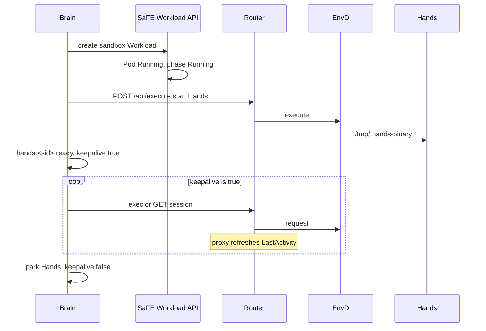

# Sandbox session lifecycle and user-process detection

This document describes how a Claw session uses a sandbox, how the Pod is managed, and how Claw decides that no user task process remains in the sandbox. Detection does not use Hyperloom, process-name allowlists, InferaDeployment or RayJob phase, or the sandbox idle-GC file stamp.

## Keepalive contract

Brain decides idle reclaim from **user tasks registered in the sandbox Pod through Claw `POST /api/execute`**.

- **Tracked**: EnvD `POST /api/execute` invoked by Claw via the Router (Hands start, Hands `spawn`, and `setsid` / `nohup` under that tree).
- **Not tracked**: other EnvD HTTP APIs (`/api/session` tmux, `/api/terminal`, files, GPU query), processes that never went through execute, and processes started by the image entrypoint. Work on those paths does not block the idle reclaim.
- **Multi-node**: only whether the launch script in the sandbox (and descendants registered through execute) is still running. InferaDeployment and RayJob status are not read. After the launch script exits, local jobs are empty even if the remote cluster is still running.
- **Cluster teardown**: a multi-node GPU workload is still released on **message terminal** (complete / failed / cancelled). Remote phase does not extend the sandbox idle clock.

## Topology

One Claw sandbox Workload maps to one Pod:

- The `envd-injector` init container copies `envd` and related binaries onto a shared volume and exits.
- The only runtime container is `codeinterpreter`. Its command `exec`s `/shared/bin/envd`. EnvD is PID 1 for the life of the container.
- Annotation `primus-safe.main.container=codeinterpreter`. `RestartPolicy` is `Never`.

The agent (prompt) runs in **brain**, not in the container. Brain reaches the Pod through the sandbox Router, which proxies `POST /api/execute` to EnvD. Hands is started the same way (`/tmp/.hands-binary`) and stays resident. User commands are children on that execute path (Hands `spawn`, or `setsid` / `nohup` in a shell).

EnvD is a long-lived HTTP server. User commands exiting does not stop EnvD. The `codeinterpreter` container stopping means EnvD itself exited (crash, OOM, node loss), not that user work finished.

Multi-node GPU work is a **separate** SaFE Workload (InferaDeployment or RayJob), created only when the prompt has `--nodes >= 2` and an explicit `--mn-backend`. `ray.init()` inside the container is not a platform RayJob. Idle detection does not use that Workload's phase.

## Current management flow



### Create

1. Brain parses the task (workspace, image, timeout, optional multi-node flags).
2. Brain creates a SaFE sandbox Workload. SaFE creates the Sandbox CR and Pod.
3. Brain waits until Workload phase is `Running`.
4. Brain starts Hands through Router → EnvD execute and writes `hands.<sid>` in KV.

### While the session uses the sandbox

- Tool calls and shells go Router → EnvD `/api/execute` (after Hands is up, also `spawn` inside the container).
- EnvD `execute` uses `Setpgid` so HTTP `CommandContext` cancellation does not kill the whole `setsid` process group.
- While an HTTP execute is in flight, the Router proxies to EnvD; it does **not** refresh Redis `LastActivity` for lifetime policy.

### Keepalive and reclaim (current)

Brain owns sandbox lifetime. There is **no** sandbox controlplane idle-GC switch: the controller is not wired, and `--enable-idle-gc` / `ENABLE_SANDBOX_IDLE_GC` are not accepted. An idle Sandbox is held until Brain reclaim or its own `ShutdownTime` / SaFE `timeout`.

Brain keepalive (default interval 60s) pings sandboxes with `keepalive: true` via a control-plane status read (no container exec). Soft / unknown control-plane states are not treated as keepalive failures.

After a task parks, `keepalive` is set false. Keepalive then probes EnvD `GET /api/jobs`. That count includes only user tasks registered through `/api/execute`. Hands `/internal/shells/active` is not the authority for idle. The reuse window starts at `quiescedAt` (first confirmed empty roster); destroy still requires a sync `count == 0`.

### Stop

Brain `destroyHands` stops the SaFE sandbox Workload and clears KV. The same message-terminal path tears down that message's multi-node Infera/RayJob. Teardown follows message terminal, not whether the remote Workload is still Running.

## What "no user task process" means

| Kind | User task process | Not counted |
|------|-------------------|-------------|
| Running Hands tools (foreground or Hands background) | yes | |
| `setsid` / `nohup` started under this session's `/api/execute` tree | yes | |
| Multi-node launch script and descendants registered through execute | yes | |
| EnvD (PID 1) | | infrastructure |
| Hands binary | | infrastructure |
| Router health check / keepalive execute | | not a user job |
| Zombie (`Z`) | | ignored |
| EnvD `/api/session`, `/api/terminal`, and other non-execute APIs | | out of contract; not kept alive |
| Processes not started through `/api/execute` | | out of contract; not kept alive |
| InferaDeployment / RayJob phase, replicas still running on the cluster | | not a signal |
| Hyperloom / `ray.init()` identified by name | | not a signal |

The agent process lives in brain. "User work in the sandbox has ended" means **every user-task PID registered through `/api/execute` has exited** (for multi-node, the launch script has exited). EnvD may still be running. A remote GPU Workload may still be running.

## How EnvD tracks those PIDs

### Why the execute child PID is not enough

Each `/api/execute` starts one command and waits for **that** process. After `setsid` the shell can exit, HTTP returns, and detached work is reparented to PID 1. EnvD no longer holds a per-request handle for those PIDs. `Setpgid` only stops the Go runtime from killing the detached group when the request context ends; it does not keep a job list.

PID 1 already reaps orphans. Mixing every session's orphans, Hands, and probes into one list cannot close out jobs, so EnvD does not classify the whole PID namespace by process name.

### Per-execute subreaper shim

Linux `PR_SET_CHILD_SUBREAPER` makes a process the reaper of orphans in its descendant tree. EnvD wraps each `/api/execute` in a shim:

```
envd (PID 1, always running)
  └── job shim (CHILD_SUBREAPER)
        ├── user command or Hands
        └── setsid children (adopted by the shim, not PID 1)
```

- HTTP can return as soon as the shell exits. Request cancellation does not stop the shim or its descendants. A command timeout sends SIGTERM to the shim, which stops only the primary process group; work that detached itself with `setsid` is not part of that group and keeps running.
- The shim stays alive until every user descendant of that job has exited, or until the job is purged.
- EnvD records the **shim PID** (the Hands start job marks the Hands PID as infrastructure).
- `GET /api/jobs` includes `pod_uid` and `instance_id`. A changed identity is a replaced sandbox, not idle. A signaled shim sets `tracking_lost`; that is unknown, not empty. It is never unset: the descendants it is about were re-parented away from every supervisor the roster walk starts at, so nothing EnvD can observe will account for them again, and a job starting later does not speak for them. A sandbox that has lost tracking is left to its own timeout rather than reclaimed as idle.

**User work remains**: a live tracked non-Hands shim exists, or the Hands job shim still has a non-zombie PID other than Hands.

**No user work remains**: only Hands (and idle shims) remain. Brain keepalive pings, container probes, and live-work reads send `untracked` execute and are not user jobs.

EnvD exposes `GET /api/jobs` for the roster and `DELETE /api/jobs` to end every tracked user job, the work its commands detached included (SIGUSR1 to each shim; the Hands supervisor is spared). Brain's idle reclaim reads only the `GET`. The `DELETE` is the deliberate call for a caller that means to empty the roster rather than to end one command; a request timeout never does that. Neither path scans the container `/proc` or queries InferaDeployment / RayJob.

A probe failure (timeout, 502) is **unknown**: no reclaim, and the session is not marked failed.

HTTP 404 / 405 / 501 on `GET /api/jobs` means this EnvD has no jobs roster (typical of a sandbox started before this change). Brain does not idle-reclaim that sandbox. The workload `timeout` stops it.

`Setpgid` remains so HTTP cancellation does not kill detached work. The shim supplies the missing roster.

## Reclaim and failure

Brain owns sandbox lifetime. Sandbox controlplane idle-GC is not available (not wired; no enable flag). Redis `LastActivity` is list/sort metadata only and is not refreshed for lifetime policy.

### SaFE failure is sandbox failure, returned to the frontend

When the SaFE **sandbox** Workload reaches a terminal phase (Failed / Stopped / Succeeded / Terminated / Cancelled, including OOM, non-zero container exit, platform `timeout`), the **sandbox is failed**, not idle-reclaimed:

- Brain raises `SandboxProvisionTerminalError` (or the keepalive probe takes the same failure path after `terminal`).
- It emits `sandboxStatus` (`status: failed` plus a stable `reason`).
- Session `exec_complete` carries `failed: true` and `failure_reason`, and the chat stream gets readable failure text.

That terminal phase is the sandbox Pod / codeinterpreter, not InferaDeployment or RayJob. The create-wait path already does this. A container fault after Running takes the same path and does not enter QUIESCED.

### The idle clock scans only Running

`GET /api/jobs` and the idle clock run **only after the sandbox Workload is Running**.

- **Pending** (queued, unschedulable): no idle release.
- A sandbox that is not yet Running does not enter DRAINING / QUIESCED.
- Pending ends only by becoming Running, a SaFE sandbox terminal failure, or the Pending timeout below.

When there is no in-flight message or tool call and `GET /api/jobs` shows no user tasks, Brain parks with `keepalive:false` and `idleSince`, and records `quiescedAt` on the first confirmed empty roster. After `SANDBOX_IDLE_REUSE_SECONDS` (default 15 minutes) from that quiesce stamp, a destroy pass **must** sync-probe `count == 0` again before CAS `ready` → `closing`. A new message clears idle markers. `unavailable` and `tracking_lost` do not trigger reclaim (workload hard timeout is the backstop). Multi-node GPU clusters are torn down after the sandbox stops (or immediately on `sessionDeleted` parks).

Reclaim and reuse compete on one CAS: `ready` → `closing`. A handle in `closing` is not reused. Stale jobs answers are discarded when the sandbox identity or idle generation changes.

```
Pending      queued; no jobs scan; no idle clock
  │ Running
  ▼
ACTIVE       in-flight message, or jobs non-empty
  │ park after the turn
  ▼
DRAINING     poll EnvD GET /api/jobs (Running only)
  │ empty → record quiescedAt, enter QUIESCED
  │ sandbox terminal → session failure to the frontend
  │ unknown / tracking_lost → stay DRAINING
  ▼
QUIESCED     the idle window, from quiescedAt
  │ new message CAS-es keepalive on → ACTIVE, clock cleared
  │ idle window elapsed → CAS to CLOSING, then destroyHands
  ▼
CLOSING      not reusable; retry stop until the workload is gone
```

That window means the **sandbox is Running, every user-task PID registered through `/api/execute` has exited, and there is no new message**. A still-running remote cluster does not extend this clock. `ttlSecondsAfterFinished` does not implement it. SaFE `timeout` is a hard cap on a Running Workload.

### Pending timeout (existing; not the idle window)

Claw has a separate queue cap, unrelated to the idle window:

| Config | Default | Role |
|--------|---------|------|
| `SANDBOX_IDLE_REUSE_SECONDS` | **15 minutes** (`900`) | Running sandbox, empty `GET /api/jobs`, no in-flight message. Clock starts at `quiescedAt`. Then CAS `ready`→`closing` and `destroyHands`. |
| `SANDBOX_PENDING_TIMEOUT_SECONDS` | **3 hours** | Sandbox Workload **phase=Pending** queued longer than this → terminal failure `sandbox_pending_timeout` to the frontend. The clock stops after leaving Pending (scheduled). Image pull is not Pending. `0` waits on the queue indefinitely. |
| `SANDBOX_POLL_TIMEOUT_MS` | 1 hour | Ends only when SaFE **status is unreadable** (sustained 5xx, network failure, no phase), reason `sandbox_status_unreadable`. Readable Pending does not trigger it. |
| SaFE Workload `timeout` | value on the task request (e.g. 46800s) | Hard cap from **StartTime / Running**, excluding queue time. |
| `RUN_QUEUE_MAX_SEC` (API) | 2 hours | Task row never claimed by a worker; not sandbox Workload Pending. |

### Container exit is failure

EnvD exiting stops `codeinterpreter`. That is an abnormal sandbox death and fails to the frontend as above.

| Observation | Session result |
|-------------|----------------|
| Pending | no idle release; wait until Pending timeout or SaFE sandbox failure |
| jobs empty, sandbox Workload Running | idle path, the idle window from `quiescedAt`, not failure |
| new message or new execute inside the window | clock reset |
| jobs non-empty, Running | keep the sandbox |
| launch script exited, Infera/RayJob still running | same as jobs empty; not kept alive |
| work only on `/api/session` or other non-execute APIs | same as jobs empty; not kept alive |
| Pod/container Failed, OOMKilled, non-zero exit | **failure to the frontend** (`sandbox_container_failed`) |
| SaFE timeout stops a still-running sandbox Workload | **failure to the frontend** (`sandbox_timed_out`) |
| EnvD jobs API unreachable | unknown, wait (and only if already Running) |
| `GET /api/jobs` is 404 / 405 / 501 | no Brain idle reclaim; workload timeout stops the sandbox |
| jobs `tracking_lost` | unknown, wait; not idle |
| Workload absent (GC / 404) | stop/release the handle; not a frontend sandbox failure |
| Pod UID or EnvD instance id changed | **failure to the frontend** (`sandbox_instance_replaced`) |
| EnvD exited 0 without Brain stop | **failure to the frontend** (`sandbox_envd_exited`) |
| Pending longer than `SANDBOX_PENDING_TIMEOUT_SECONDS` | **failure to the frontend** (`sandbox_pending_timeout`) |

On failure: session terminal ack, a stable `failure_reason`, stop the sandbox Workload, clear `hands.<sid>`. Do not enter QUIESCED.

## SaFE mapping (container terminal)

The Sandbox ResourceTemplate must list Sandbox `Succeeded` / `Failed` conditions **before** `Ready=False`, so a dead Pod becomes Workload `K8sSucceeded` / `K8sFailed` rather than staying `NotReady`. Brain `get()` treats failed/stopped/succeeded/completed/cancelled/terminated as `terminal`.

OOM and crash reasons belong on the Workload so brain can distinguish `sandbox_container_failed` from `sandbox_timed_out`. A long or zero `ttlSecondsAfterFinished` is leak cleanup only, not the idle clock.

## Acceptance

| State | jobs API | sandbox Workload | Action |
|-------|----------|------------------|--------|
| queued / unschedulable | not scanned | Pending | no idle release |
| Pending longer than 3 hours (default) | — | Pending | failure to the frontend `sandbox_pending_timeout` |
| turn parked, execute tree empty | empty | Running | record `quiescedAt`, idle reclaim |
| new message inside the window | — | Running | ACTIVE, clock cleared |
| detached command still running via execute | non-empty | Running | keep |
| launch-script PID exited | empty | Running | start the idle window; do not query Infera/RayJob |
| work only on the tmux session API | empty | Running | idle reclaim |
| SaFE reports sandbox Failed / OOM / container exit | — | Failed | failure to the frontend |
| platform timeout | — | Stopped (timeout) | failure to the frontend |
| Router briefly unreachable | unknown | Running | wait, do not reclaim |
| jobs API 404 / 405 / 501 | absent | Running | no Brain reclaim; workload timeout |
| jobs tracking_lost | unknown | Running | wait, do not reclaim |
| Workload absent | — | absent | stop/release handle; not a frontend failure |
| Pod replaced under the same name | — | Running or terminal | failure `sandbox_instance_replaced` |
| EnvD exit 0 without Brain stop | — | Succeeded | failure `sandbox_envd_exited` |
| reclaim vs new message | empty | Running | CAS `closing`; loser does not reuse |
