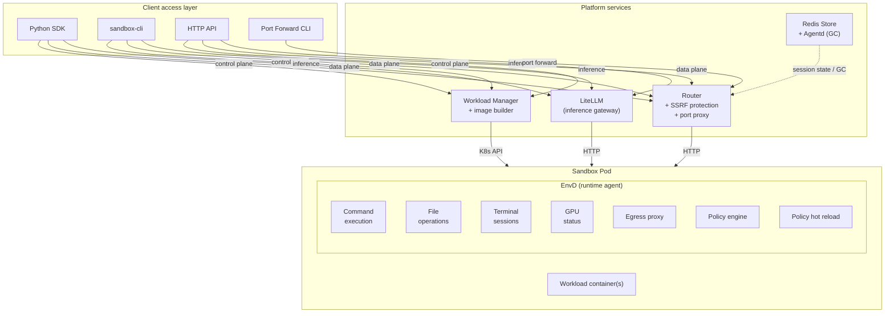

# Agent Sandbox Architecture

End-to-end view of how clients reach a sandbox and what runs inside the Pod.

## Components

| Component | Role |
| --- | --- |
| **Python SDK / sandbox-cli / HTTP API** | Client entry points for the management and sandbox APIs. |
| **Port Forward CLI** | Forwards a local port to a sandbox port through the Router's port proxy. |
| **Workload Manager** | Control plane: template/sandbox lifecycle on the K8s API, plus on-demand image building. |
| **Router** | Unified API gateway: routes data-plane invocations to the target Pod, with SSRF protection and port proxying. |
| **LiteLLM** | Inference gateway for OpenAI-compatible model calls from inside sandboxes. |
| **Redis Store + Agentd** | Session/state store and a background GC that reclaims expired sandboxes as a safety net. |
| **EnvD** | In-Pod runtime agent (port `8080`) exposing command execution, file operations, terminal sessions and GPU status, plus an egress proxy with a policy engine and hot policy reload. |
| **Workload container(s)** | The user's base image / sidecars running alongside EnvD. |

## Request planes

- **Control plane** — template and sandbox lifecycle, served by the Workload Manager.
- **Data plane** — code execution, files, sessions, terminal and GPU, served by EnvD and fronted by the Router.
- **Inference** — model calls routed through LiteLLM.
- **Port forward** — direct access to a sandbox port via the Router's port proxy.

See [API.md](./API.md) for the concrete HTTP routes.
